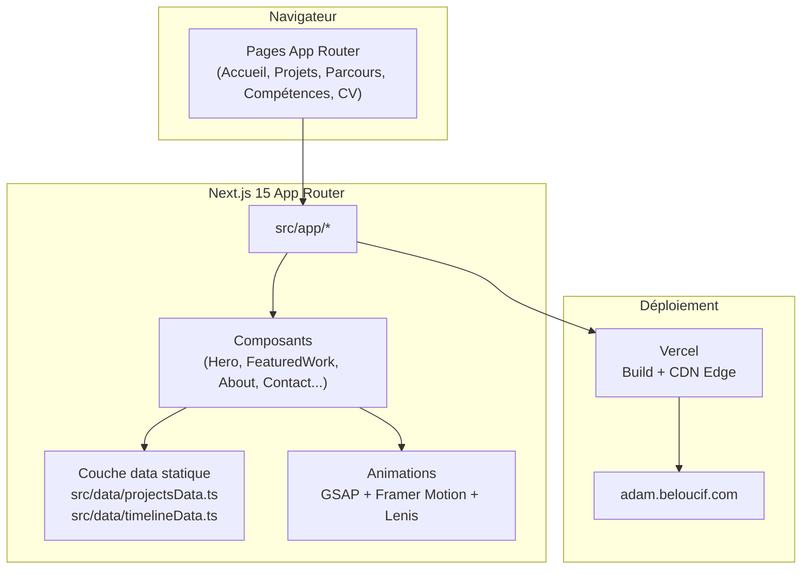

# Portfolio personnel - Adam Beloucif

[](https://github.com/Adam-Blf/adam-portfolio/releases)

<!-- adam-badges:start -->
[](https://github.com/Adam-Blf/adam-portfolio/commits) [](https://hits.sh/github.com/Adam-Blf/adam-portfolio/) [](https://github.com/Adam-Blf/adam-portfolio/commits) [](https://github.com/Adam-Blf/adam-portfolio) [](LICENSE)
<!-- adam-badges:end -->

Portfolio personnel d'Adam Beloucif, Data Engineer et développeur Fullstack (Mastère Data Engineering & IA, EFREI Paris / Université Paris-Panthéon-Assas). Le site présente le parcours, les compétences et un catalogue de 32 projets, du data engineering hospitalier aux applications web et jeux.

Déployé sur `adam.beloucif.com` via Vercel.

## Architecture



Le site est un catalogue statique (pas de base de données) : la source unique des projets est `src/data/projectsData.ts`, consommée à la fois par la page d'accueil (section projets sélectionnés) et par `/projets` (catalogue filtrable complet).

## Fonctionnalités

- Page d'accueil avec hero animé, marquee, grille de services et projets sélectionnés (sticky stacking cards)
- Page `/projets` : catalogue complet filtrable par catégorie avec étude de cas en modale
- Page `/parcours` : timeline du parcours académique et professionnel
- Page `/competences` : cartographie des compétences techniques
- Page `/cv` : CV consultable en ligne, imprimable en PDF
- Pages `/mentions-legales` et `/confidentialite`
- Page 404 personnalisée
- Animations GSAP ScrollTrigger et Framer Motion, scroll fluide Lenis

Le dark mode n'existe pas encore. Il était annoncé ici alors qu'aucune règle
`dark:` n'existait dans le code, mention retirée le 2026-08-08. Il arrive avec la
refonte de la direction artistique.

## Stack technique

| Catégorie | Technologie |
|---|---|
| Framework | Next.js 15 (App Router) |
| Langage | TypeScript (strict) |
| Style | Tailwind CSS v4 |
| Animations | GSAP 3 (ScrollTrigger), Framer Motion |
| Scroll fluide | Lenis |
| Icônes | Lucide React |
| Déploiement | Vercel |

## Développement local

```bash
# Cloner le dépôt
git clone https://github.com/Adam-Blf/adam-portfolio.git
cd adam-portfolio

# Installer les dépendances
npm install

# Lancer le serveur de développement
npm run dev

# Build de production
npm run build

# Vérification des types
npx tsc --noEmit
```

Aucune variable d'environnement n'est nécessaire. Le site doit démarrer et
fonctionner entièrement sans fichier `.env`.

## Gardes de non-régression

Trois scripts en Node pur, sans dépendance, exécutés en CI avant même
l'installation des paquets.

| Garde | Ce qu'elle verrouille |
|---|---|
| `node tools/check_no_fake_content.mjs` | Marques partenaires inventées, publications fictives, recommandations sans source, ton agence |
| `node tools/check_typography.mjs` | Tiret cadratin, demi-cadratin, médiopoint |
| `node tools/check_routes.mjs` | Cohérence entre `src/lib/routes.ts`, `src/app`, le sitemap et le robots |

**Une garde doit être vue rouge avant d'être crue.** Une garde jamais mise en
échec ne garde rien. Avant d'accepter l'une d'elles comme verte, on casse
volontairement ce qu'elle protège et on vérifie qu'elle sort en code 1. Exemples
à rejouer, sur une branche jetable puis `git checkout -- .` :

```bash
# Contenu : réinjecter une marque inventée, une citation sans source,
# et surtout une chaîne interdite coupée en deux par le formatage JSX.
# Ce dernier cas est celui qui a révélé un vrai défaut : la garde lisait
# ligne à ligne, elle lit désormais le fichier entier avec les espaces
# normalisés.

# Routes : ajouter au sitemap une route qui n'existe pas, ou remettre
# "/projets" dans les chemins interdits aux robots. C'est le bug qui a
# désindexé le site pendant des mois.

# Typographie : coller un tiret cadratin dans une chaîne visible,
# puis dans un commentaire, puis dans le CHANGELOG.
```

Chaque garde documente en tête ce qu'elle **ne voit pas**. Une garde dont on
surestime la portée fait cesser de regarder, ce qui est pire que pas de garde.

## Structure du projet

```
src/
  app/            Pages App Router (accueil, projets, parcours, competences, cv, not-found)
  components/     Composants React (Hero, Navbar, FeaturedWork, About, Contact, Footer...)
  data/           Source unique des données (projectsData.ts, timelineData.ts)
  lib/            Utilitaires partagés (version.ts, utils.ts)
public/
  projects/       Captures d'écran des projets
```

## Auteur

**Adam Beloucif**
Data Engineer & Développeur Fullstack, Mastère Data Engineering & IA (EFREI Paris)
[Portfolio](https://adam.beloucif.com) - [GitHub](https://github.com/Adam-Blf) - [LinkedIn](https://www.linkedin.com/in/adambeloucif/)
