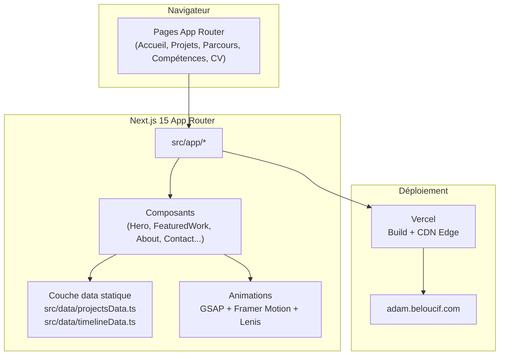

# Portfolio personnel - Adam Beloucif

<!-- adam-badges:start -->
[](https://github.com/Adam-Blf/adam-portfolio/commits) [](https://hits.sh/github.com/Adam-Blf/adam-portfolio/) [](https://github.com/Adam-Blf/adam-portfolio/commits) [](https://github.com/Adam-Blf/adam-portfolio) [](LICENSE)
<!-- adam-badges:end -->

Portfolio personnel d'Adam Beloucif, Data Engineer et développeur Fullstack (Mastère Data Engineering & IA, EFREI Paris / Université Paris-Panthéon-Assas). Le site présente le parcours, les compétences et un catalogue d'une trentaine de projets, du data engineering hospitalier aux applications web et jeux.

Déployé sur `adam.beloucif.com` via Vercel.

## Architecture



Le site est un catalogue statique (pas de base de données) : la source unique des projets est `src/data/projectsData.ts`, consommée à la fois par la page d'accueil (section projets sélectionnés) et par `/projets` (catalogue filtrable complet).

## Fonctionnalités

- Page d'accueil avec hero animé, marquee, grille de services et projets sélectionnés (sticky stacking cards)
- Page `/projets` : catalogue complet filtrable par catégorie avec étude de cas en modale
- Page `/parcours` : timeline du parcours académique et professionnel
- Page `/competences` : cartographie des compétences techniques
- Page `/cv` : CV consultable en ligne
- Page 404 personnalisée
- Dark mode natif, animations GSAP ScrollTrigger et Framer Motion, scroll fluide Lenis

## Stack technique

| Catégorie | Technologie |
|---|---|
| Framework | Next.js 15 (App Router) |
| Langage | TypeScript (strict) |
| Style | Tailwind CSS v4 |
| Animations | GSAP 3 (ScrollTrigger), Framer Motion |
| Scroll fluide | Lenis |
| Icônes | Lucide React |
| Déploiement | Vercel |

## Développement local

```bash
# Cloner le dépôt
git clone https://github.com/Adam-Blf/adam-portfolio.git
cd adam-portfolio

# Installer les dépendances
npm install

# Lancer le serveur de développement
npm run dev

# Build de production
npm run build

# Vérification des types
npx tsc --noEmit
```

## Structure du projet

```
src/
  app/            Pages App Router (accueil, projets, parcours, competences, cv, not-found)
  components/     Composants React (Hero, Navbar, FeaturedWork, About, Contact, Footer...)
  data/           Source unique des données (projectsData.ts, timelineData.ts)
  lib/            Utilitaires partagés (version.ts, utils.ts)
public/
  projects/       Captures d'écran des projets
```

## Auteur

**Adam Beloucif**
Data Engineer & Développeur Fullstack, Mastère Data Engineering & IA (EFREI Paris)
[Portfolio](https://adam.beloucif.com) - [GitHub](https://github.com/Adam-Blf) - [LinkedIn](https://www.linkedin.com/in/adambeloucif/)
