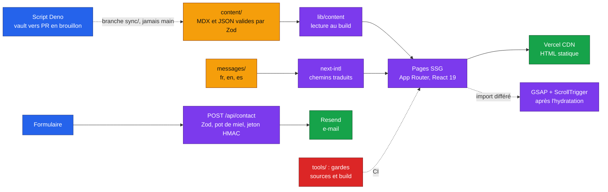

# adam-portfolio


Version 3.0.0. Portfolio d'Adam Beloucif, [adam.beloucif.com](https://adam.beloucif.com). Direction "poste de pilotage" : sombre par défaut, ambre sur graphite, un rail latéral avec une jauge de défilement réelle, des panneaux à repères d'angle et un journal de parcours. Français par défaut, anglais et espagnol.

Chaque phrase du site vient d'un fait sourcé (`content/`). Aucun niveau de compétence sans projet qui le prouve, aucun chiffre sans source, aucun nom d'établissement.

## Démarrer

```bash
npm install
npm run dev          # http://localhost:3100
npm run typecheck && npm run lint && npm test && npm run guards
npm run build && npm run guards:built
```

Le formulaire de contact a besoin de quatre variables d'environnement (voir `.env.example`, sans aucune valeur). Sans elles, `/api/contact` répond 503 et le reste du site fonctionne.

| Variable | Rôle |
|---|---|
| `RESEND_API_KEY` | clé Resend, côté serveur seulement |
| `CONTACT_TO` | adresse qui reçoit les messages |
| `CONTACT_FROM` | expéditeur (domaine vérifié dans Resend) |
| `FORM_HMAC_SECRET` | secret du jeton horodaté anti-robots |
| `NEXT_PUBLIC_SITE_URL` | URL publique (canoniques, hreflang, sitemap) |

## Architecture


```mermaid
flowchart LR
    C["content/<br/>MDX et JSON valides par Zod"]:::store --> L["lib/content<br/>lecture au build"]:::process
    M["messages/<br/>fr, en, es"]:::store --> I["next-intl<br/>chemins traduits"]:::process
    L --> P["Pages SSG<br/>App Router, React 19"]:::process
    I --> P
    P --> V["Vercel CDN<br/>HTML statique"]:::output
    P -. "import différé" .-> G["GSAP + ScrollTrigger<br/>après l'hydratation"]:::process
    F["Formulaire"]:::input --> A["POST /api/contact<br/>Zod, pot de miel, jeton HMAC"]:::process
    A --> R["Resend<br/>e-mail"]:::output
    S["Script Deno<br/>vault vers PR en brouillon"]:::input -. "branche sync/, jamais main" .-> C
    T["tools/ : gardes<br/>sources et build"]:::guard -. "CI" .-> P
    classDef input fill:#2563eb,stroke:#1e3a8a,color:#fff
    classDef process fill:#7c3aed,stroke:#4c1d95,color:#fff
    classDef store fill:#f59e0b,stroke:#92400e,color:#111
    classDef output fill:#16a34a,stroke:#14532d,color:#fff
    classDef guard fill:#dc2626,stroke:#7f1d1d,color:#fff
```

| Route (FR) | EN | ES | Rendu |
|---|---|---|---|
| `/` | `/en` | `/es` | statique |
| `/a-propos` | `/en/about` | `/es/sobre-mi` | statique |
| `/projets`, `/projets/[slug]` | `/en/projects`, `.../[slug]` | `/es/proyectos`, `.../[slug]` | statique |
| `/notes`, `/notes/[slug]` | `/en/notes`, `.../[slug]` | `/es/notas`, `.../[slug]` | statique |
| `/contact` | `/en/contact` | `/es/contacto` | statique + `POST /api/contact` |
| `/cv` | `/en/cv` | `/es/cv` | statique, imprimable (une page, format Harvard) |
| `/mentions-legales`, `/confidentialite` | `/en/legal-notice`, `/en/privacy` | `/es/aviso-legal`, `/es/privacidad` | statique |

Les anciennes URLs `/parcours`, `/competences` et `/frise` redirigent en 308.

## Contenu

`content/` est la seule source des faits. Un fichier qui ne respecte pas `src/lib/schemas/content.ts` fait échouer le build.

- `projects/<slug>/meta.json` : faits non traduisibles, autorisations (`visibility`), provenance.
- `projects/<slug>/{fr,en,es}.mdx` : texte, résultats, limites.
- `notes/<slug>/{fr,en,es}.mdx` : notes de terrain. Aucune n'est publiée au lancement : état vide soigné.
- `timeline/<id>.json`, `skills.json`, `metrics.json`, `profile/identity.json`.

Règles gravées dans les schémas : un projet `hospital` n'a jamais de lien vers le code ni vers une démonstration, et ne se publie qu'anonymisé ; un projet `client` ne se publie pas sans accord ; un co-auteur nommé exige son accord ; un chiffre affiché cite une source de `metrics.json` ; une compétence renvoie à un projet qui la prouve.

## Gardes

`npm run guards` (sources) et `npm run guards:built` (après build) lancent les contrôles de `tools/`. Chacune a été vue rouge sur un cas saboté (`tests/guards.test.ts`) avant d'être crue.

| Garde | Interdit |
|---|---|
| `check_no_fake_content` | produits d'IA, certifications, intitulés écartés, formules de recherche d'emploi, pronoms d'agence |
| `check_typography` | tiret long, demi-cadratin, médiopoint, caractères invisibles |
| `check_pii` | téléphone, NIR, IBAN, SIRET, e-mail tiers, noms d'établissement et d'outils hospitaliers |
| `check_icons` | tout sauf Reicon, emojis |
| `check_i18n` | clé manquante, langues désalignées |
| `check_content` | schémas, chiffres sans source, preuves de compétence inconnues |
| `check_routes` | page absente du routage ou du sitemap, robots qui bloque une page |
| `check_fonts` | famille non déclarée ou bannie |
| `check_cdn` | ressource tierce dans le HTML, CSS ou JS construit |
| `check_perf_budget` | dépassement des budgets de poids |

Contrastes : `node tools/contrast_report.mjs` mesure les paires de `tokens.css` dans les deux thèmes (texte 4,5:1, bordures et fonds de bouton 3:1).

## Mise à jour depuis le vault

Principe : proposer, jamais publier. Le script Deno lit les notes du vault qui portent un bloc `portfolio:` (`publish: true`), propose des brouillons sur une branche `sync/AAAA-MM-JJ` et ouvre une PR en brouillon. Il n'écrit jamais `approvals`, `reviewedBy` ni `reviewedOn`, ne passe jamais `publish` à `true`, ne fusionne rien.

```bash
deno task sync:dry       # lit, planifie, écrit .sync/report.json, ne touche à rien d'autre
deno task sync:fixture   # même chose sur le vault factice de scripts/sync/fixtures
deno task sync:apply     # branche, brouillons, commits, PR en brouillon (nécessite gh)
```

Permissions Deno : lecture du vault, de `SESSIONS.md` et du dépôt ; écriture dans `content/` et `.sync/` ; `git`, `gh`, `node`, `gitleaks` ; ni réseau ni variables d'environnement. `SESSIONS.md` ne sert que de signal d'activité : seuls des comptes par projet sont conservés, jamais un titre ni un identifiant.

Format d'opt-in dans une note du vault :

```yaml
portfolio:
  publish: true
  kind: project        # project | note | timeline
  slug: mon-projet
  projectKind: school  # hospital | school | studio | client | personal
  stack: [Python, DuckDB]
  redact: ["chaîne à masquer"]
```

## Sécurité et vie privée

Aucun cookie, aucun traceur, aucune ressource tierce : les polices, les logos et les icônes sont servis en local. Le thème choisi est mémorisé dans le navigateur (clé `ab-theme`). En-têtes : CSP stricte, `frame-ancestors 'none'`, `Referrer-Policy`, `Permissions-Policy`. Le formulaire : validation Zod, pot de miel, jeton horodaté signé HMAC (2 s à 2 h), contrôle d'origine, aucune trace d'erreur renvoyée. Limite de débit à poser en règle Vercel Firewall sur `/api/contact`.

## Déploiement

Branche `main` protégée, PR obligatoire, CI verte. Après une mise en production, preuve : `curl -4 https://adam.beloucif.com` contient un texte propre à la v3 et ne contient plus "DISPONIBLE" (piège du domaine relié au mauvais projet Vercel).

## Décisions

Les choix durables sont dans `docs/adr/`. L'inventaire des boutons (page, stade, libellé, contraste) est dans `docs/boutons.md`.

## Licence

MIT, voir `LICENSE`. Les polices Funnel Display, Funnel Sans et B612 Mono sont sous SIL Open Font License (`public/fonts/OFL-*.txt`).
